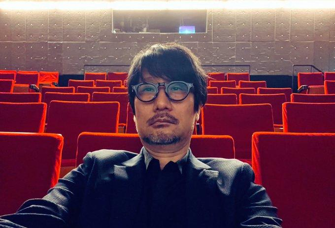

# 💙 My Freak Girlfriend - Landing Page

This is a fun, responsive landing page built with HTML and CSS. It demonstrates basic front-end design using **flexbox layout**, **typography**, and **visual hierarchy**, structured around a fictional and quirky theme: *"My Freak Girlfriend."*

## 📄 Project Overview

This project includes:

- A **header** with placeholder logo and navigation links.
- A **hero section** with a bold headline, supporting text, and a CTA (Call to Action) button.
- A **four-column feature section** with image thumbnails and subtext.
- A **quote/testimonial section**.
- A **CTA banner** section.
- A **footer** with a personalized message.

## 🖼️ Preview

  
> *Note: Image assets should be stored in a `./img/` folder.*

## 🧰 Technologies Used

- **HTML5**
- **CSS3**
  - Flexbox
  - Media queries for basic responsiveness
- No JavaScript is used in this version

<pre> ## 📁 File Structure ``` project-root/ ├── index.html # Main HTML file ├── style.css # Styling └── img/ # Folder for images (e.g., screenshot, thumbnails) ``` </pre>

## 🚀 Getting Started

1. Clone or download this repository.
2. Make sure to place your images in the `img/` folder.
3. Open `index.html` in your browser to see the result.

## 📝 Customization Ideas

- Replace placeholder texts and images with your own content.
- Add hover effects or transitions for better interactivity.
- Make the layout fully responsive using more advanced media queries.
- Connect a backend or form submission if you want to use the "Sign Up" buttons.

## ❤️ Message

> I LOVE MY GIRLFRIEND YO ❤️


